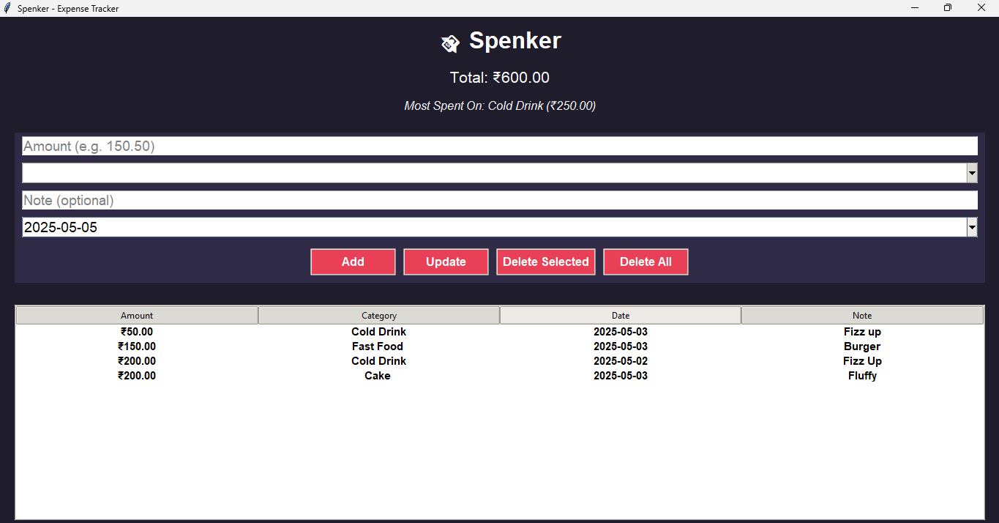

# 💸 Spenker - Expense Tracker 2.0


> A modern, lightweight, and smart personal expense tracker with real-time analytics and user-friendly features.

---

## ✨ What's New in v2.0

🔹 Brand new **modern UI** with hover effects and styled buttons  
🔹 **Date Picker (Calendar-based)** for accurate date entries  
🔹 **Dropdown with predefined categories** and support for **custom categories**  
🔹 **Top Category Spending Analytics** — tracks your most expensive spending area  
🔹 Enhanced **real-time total expense calculator**  
🔹 **Improved input validation & error handling**  
🔹 Modular and maintainable code with **SQLite** as backend  
🔹 Support for **dark mode** (coming soon!)

---

## 🧰 Features at a Glance

| Feature                          | Description                                                         |
|----------------------------------|---------------------------------------------------------------------|
| 🧾 Add Expenses                  | Input amount, select category, add notes, and pick date             |
| 🔄 Update & Delete Records       | Modify or delete any selected expense with one click                |
| 📅 Built-in Calendar             | Easily select dates using a pop-up calendar widget                  |
| 📊 Total Spending Tracker        | View the total of all recorded expenses instantly                   |
| 🥇 Top Spending Category         | Identifies the category where you've spent the most                 |
| 💾 Data Persistence              | All data is saved using a local SQLite database                     |
| 🖱️ Modern Tkinter GUI           | Clean UI with styled components and user-friendly layout            |
| ✅ Validations & Feedback        | Prevents wrong input and notifies users clearly                     |

---

## 📸 Screenshots

> 📷 Screenshot of Spenker Expense Tracker main screen



---

## 🛠️ Installation

### Prerequisites
- Python 3.9+
- Install `tkcalendar` via pip:

```bash
pip install tkcalendar
